# Fintino — Modern Banking App

> A polished, design-system-driven banking app built in Flutter.
> Beautiful in both **dark** and **light** mode, fully interactive,
> and runs on iOS / Android / Web / Desktop from one codebase.

<p align="center">
  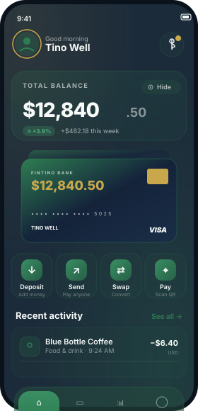
  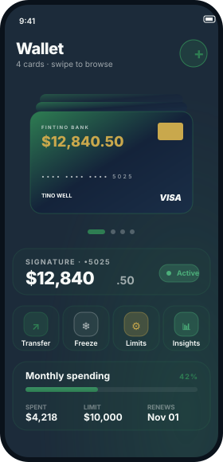
  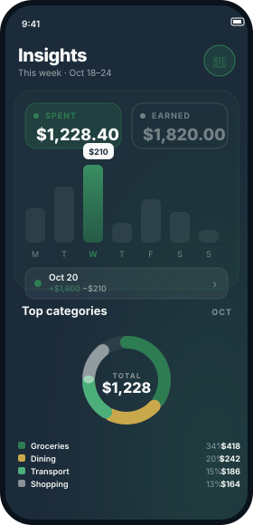
</p>

---

## ✨ For everyone — what is Fintino?

Fintino is a **digital banking experience**. Think of it like an app from
your bank, but reimagined with a calmer, more elegant look. From the home
screen you can:

- 👀 See your **total balance** at a glance with hide/show
- 🃏 Browse your **cards** — VISA, Mastercard, Amex, and a virtual card —
  with a swipeable stack
- 💸 **Send money** to friends with a satisfying slide-to-confirm gesture
- 📊 Check your **weekly spending** in a chart and see categories in a donut
- 🔔 Get notified about activity, mark all as read with one tap
- ⚙️ Toggle **dark / light theme** from your profile

Every button does something — freeze a card, dispute a charge, copy a
reference number, change your language, etc. (no real money moves — this is
a UI demonstration, not a connected bank).

### Highlights

| | |
|---|---|
| 🎨 **Two themes** | Atmospheric dark + airy ivory light, both designed from scratch |
| 🃏 **Premium card** | Guilloché pattern, embossed chip, holographic shimmer, network logos |
| 🌊 **Smooth motion** | Count-up balances, spring toggles, drag-to-swipe cards, slide-to-send |
| 📳 **Tactile** | Light haptic feedback on every press |
| 🌍 **Universal** | Same code runs on iOS, Android, Web, macOS, Windows, Linux |

---

## 📸 Screenshots

> Mockups below are pixel-accurate SVG previews of every screen in the app
> built from the same design tokens (`tokens.css` / `tokens.dart`). Replace
> any of them with real captures by following [`screenshots/README.md`](screenshots/README.md).

### Onboarding & Auth
| Onboarding | Sign in |
|---|---|
| 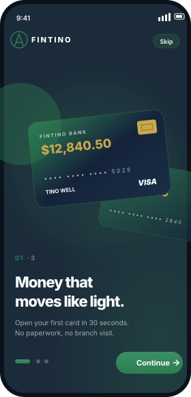 | 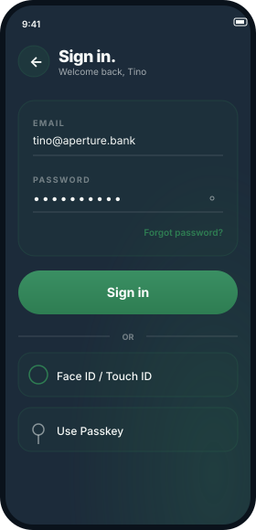 |

### Main tabs
| Home (dark) | Home (light) | Wallet | Stats | Profile |
|---|---|---|---|---|
|  | 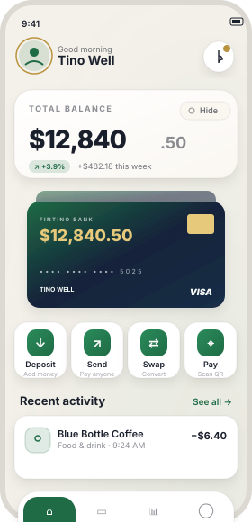 |  |  | 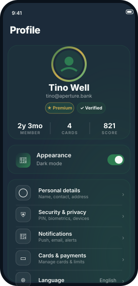 |

### Flows
| Send money | Receipt | Transaction detail | Notifications |
|---|---|---|---|
| 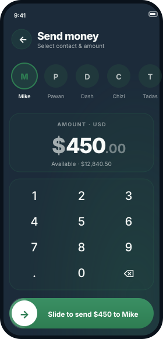 | 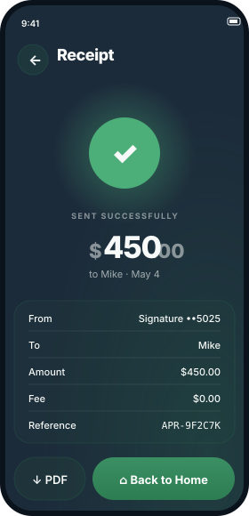 | 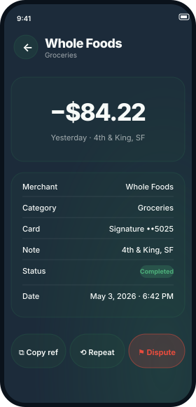 | 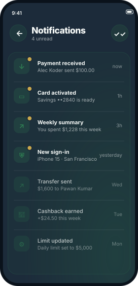 |

---

## 🚀 Getting started

### Prerequisites

- **[Flutter SDK](https://docs.flutter.dev/get-started/install)** 3.19 or
  newer (`flutter --version` to check)
- A device, emulator, or simulator — or just Chrome for the web build

### Run it

```bash
git clone https://github.com/itz-Izma-Ali/Fintino.git
cd Fintino
flutter pub get
flutter run            # picks the connected device automatically
```

Pick a target explicitly:

```bash
flutter run -d chrome          # web
flutter run -d windows         # Windows desktop
flutter run -d "iPhone 15"     # iOS simulator
```

### Build a release artifact

```bash
flutter build apk --release      # Android
flutter build ios --release      # iOS
flutter build web --release      # web
flutter build windows            # Windows
```

---

## 🧱 Tech stack

| Layer | Choice | Why |
|---|---|---|
| **Framework** | Flutter 3.x | One codebase, native performance, rich animation primitives |
| **Language** | Dart 3 | Sound null-safety, records, pattern-matching |
| **State** | `provider` + `ChangeNotifier` | Lightweight; perfect for theme + tab state |
| **Fonts** | `google_fonts` (DM Sans) | Matches the original design tokens |
| **Architecture** | Feature-first folders + theme extension | Easy to grow into many tabs/flows |

---

## 🗂 Project structure

```
lib/
├── main.dart                  # App entry — Provider + MaterialApp + status bar
│
├── core/
│   ├── state/app_state.dart   # ChangeNotifier: themeMode + tabIndex
│   └── theme/
│       ├── tokens.dart        # Design tokens + FintinoColors ThemeExtension
│       └── app_theme.dart     # ThemeData (dark + light) + FTType text scale
│
├── data/
│   ├── models/models.dart     # Txn, CardModel, Contact, DayBar
│   └── mock/mock_data.dart    # Mock cards, transactions, contacts, chart data
│
├── widgets/                   # Reusable primitives
│   ├── glass.dart             # Adaptive container — frosted (dark) / solid (light)
│   ├── press.dart             # Tap-scale + haptic feedback wrapper
│   ├── buttons.dart           # Pill Btn + round GlassIconButton
│   ├── top_bar.dart           # Screen header with back button
│   ├── tab_bar.dart           # Floating bottom tab bar with labels
│   ├── bank_card.dart         # Premium gradient card (chip, pattern, networks)
│   ├── money_display.dart     # Eased count-up animated currency
│   ├── donut_chart.dart       # Animated category donut chart
│   ├── toggle_switch.dart     # Spring toggle
│   ├── list_row.dart          # Settings/list row + FDivider
│   ├── aurora_background.dart # Layered radial glows
│   └── feedback.dart          # Styled snackbar toasts
│
└── screens/
    ├── main_shell.dart                # Tab host with animated switcher
    ├── common/placeholder_screen.dart # Reusable stub for stand-in routes
    ├── onboarding/                    # 3-step onboarding
    ├── auth/                          # Sign in
    ├── home/                          # Hero balance + activity
    ├── wallet/                        # Drag-to-swipe card stack
    ├── stats/                         # Bar chart + donut + categories
    ├── profile/                       # Profile + 5 sub-screens
    ├── send/                          # Send → slide-to-send → receipt
    └── transactions/                  # All txns, txn detail, notifications
```

---

## 🎨 Design system

The look is driven by **design tokens** in [`lib/core/theme/tokens.dart`](lib/core/theme/tokens.dart):

- **Spacing** — `2xs … 5xl` (2 px → 48 px)
- **Radius** — `sm … xl` + `pill`
- **Durations & easings** — `durFast / durNormal / durSlow / durSlower`
- **Colors** — split into a `FintinoColors` `ThemeExtension`, accessible
  anywhere as `context.c.accent`, `context.c.fg2`, etc. — like CSS variables.

Two themes are defined:

- **Dark** — warm slate + green accent + atmospheric aurora + frosted-glass
  containers
- **Light** — warm ivory cream + deep forest accent + crisp paper-card
  surfaces with paper-soft shadows

Switch from **Profile → Appearance** at runtime.

---

## ⚡ State management

```dart
class AppState extends ChangeNotifier {
  ThemeMode themeMode = ThemeMode.dark;
  int tabIndex = 0;
  void toggleTheme() { /* … */ }
  void setTab(int i) { /* … */ }
}
```

Mounted at the root with `ChangeNotifierProvider`. Per-screen state
(form values, selected day, drag offsets, animation controllers) stays
local to its `StatefulWidget`.

---

## 🎬 Notable interactions

- **Swipeable card stack** — drag the front card horizontally; cards behind
  scale down with a 16 px peek; swiped-past cards are hidden. Active card is
  always rendered on top via stable z-ordering.
- **Slide-to-send** — drag-confirm pill on the Send Money screen; the knob
  follows your finger, the track fills, and at 82 % a haptic-confirmed
  send completes.
- **Count-up amounts** — every money value animates from 0 to its target
  using an ease-out cubic curve.
- **Animated bar chart** — bars rise with a staggered cascade; selected day
  shows a gradient + glow + tooltip.
- **Donut chart** — animated sweep with rounded caps and a center total.
- **Pull-to-refresh** on Home — re-runs the balance count-up.
- **Date-range picker** in Stats — themed to the app's accent color.

---

## 📂 Notes

- The first time you clone, run `flutter pub get` to fetch dependencies
  (`provider`, `google_fonts`).
- Card numbers, balances, and contacts are **mock data** in
  [`lib/data/mock/mock_data.dart`](lib/data/mock/mock_data.dart). Swap them
  for an API client when you're ready to hook up a real backend.
- All snackbars/screens behind buttons are visual only — there is no
  network or database layer.
- Lucide icons in the source design map to Material's nearest equivalent.

---

## 🤝 Contributing

PRs welcome — keep widgets small, prefer composition, and read tokens
through the `FintinoColors` extension instead of hardcoding hex values.

## 📜 License

Add your preferred license here.

---

<p align="center">
  Built with 💚 in Flutter.
</p>
